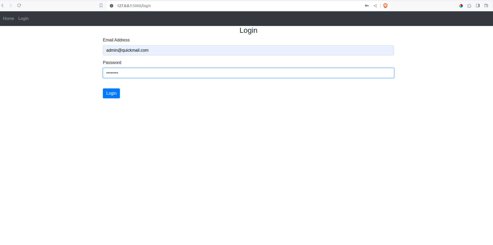
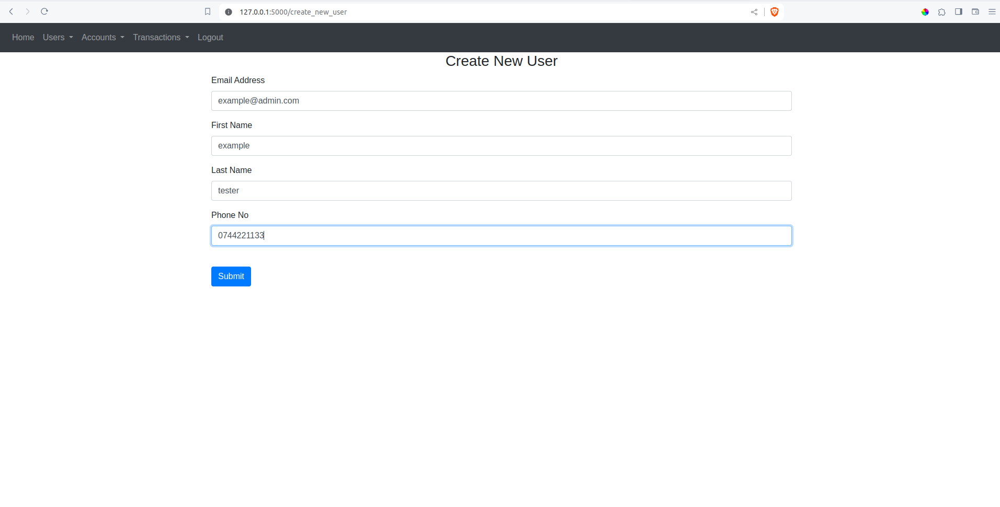
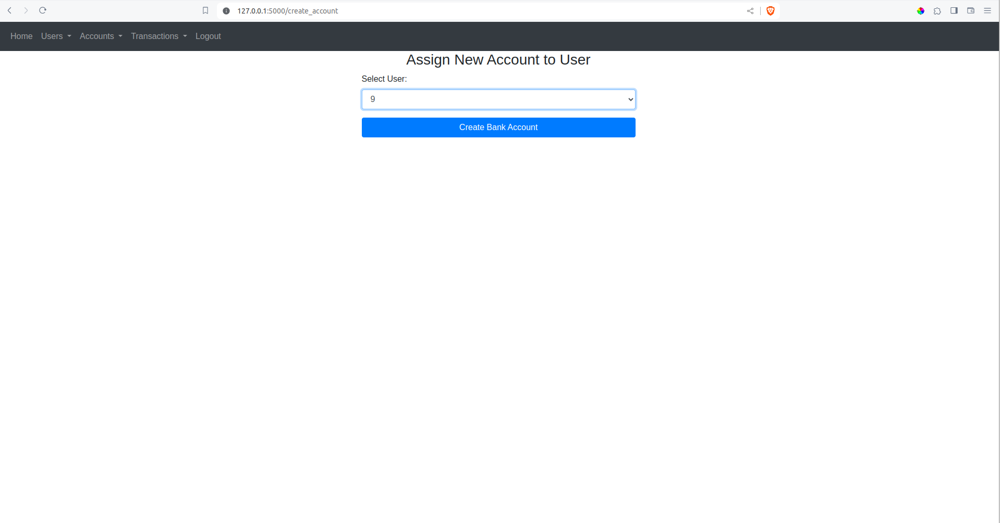
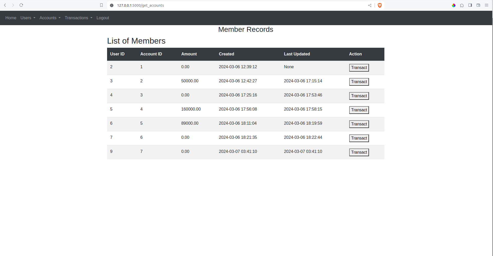
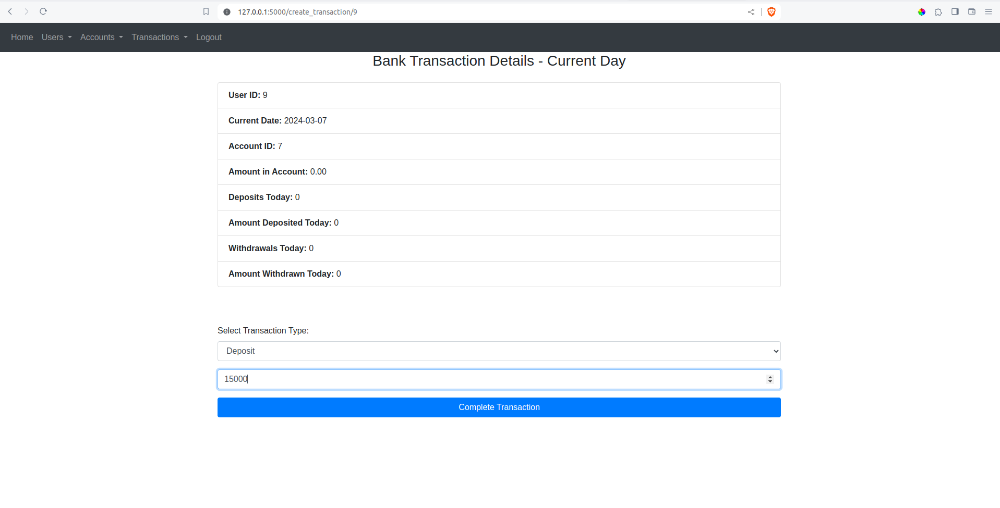
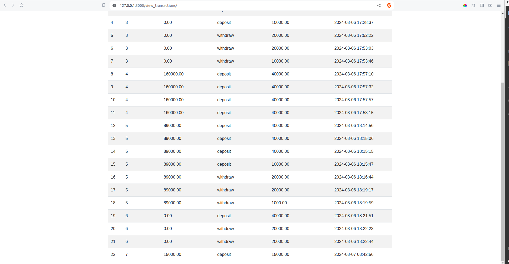
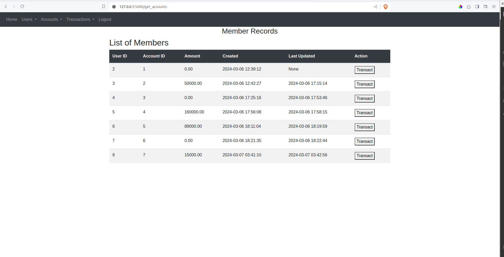
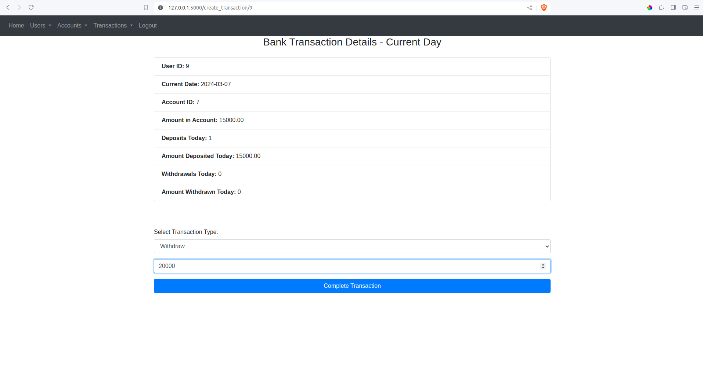
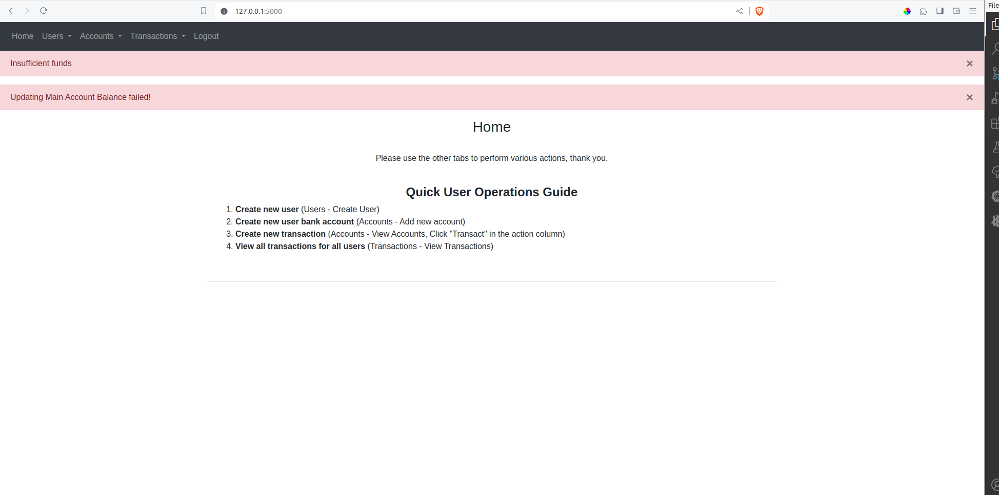

# bank_account

## Instructions for running project locally
### Ensure you have the following in your development environment:
Install python3

``` sudo apt install python3 ```

Install Flask 

``` pip install flask ```

Install Flask-Login 

``` pip install flask-login ```

Install Flask Alchemy

``` pip install flask-sqlalchemy ```

### Clone this repository to your development environment.
Navigate to the root folder, create .env file and run main.py

``` cd bank_account ```

Install dotenv package

``` pip3 install python-dotenv ```

Create .env file(in root directory) and add the following:

``` touch .env ```

``` DB_NAME = "bank_account_solution.db" ```

``` SECRET_KEY = 'ADD SECRET KEY HERE' ```

Run main.py

``` python3 main.py ```

You will get a url which will help you access the platform on a browser

``` http://127.0.0.1:5000 ```

# Web View

## Default login credentials

``` username: admin@quickmail.com    password: 1234567 ```

# Login


# Create new user


# Create Bank Account


# View Bank Account and Transact


# Create Transaction - Deposit


# View Transaction


# View User Account Balance


# Create Transaction - Withdrawal( Exeeding amount in account)


